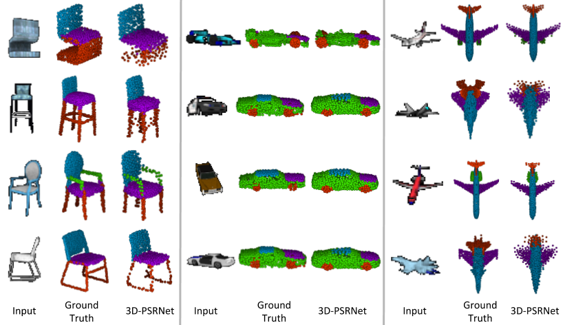

# 3D-PSRNet
This repository contains the source codes for the paper [3D-PSRNet: Part Segmented 3D Point Cloud Reconstruction From a Single Image](https://arxiv.org/abs/1810.00461).</br>
Accepted at *3D Reconstruction Meets Semantics* - ECCV 2018 Workshop

## Citing this work
If you find this work useful in your research, please consider citing:
```
@inproceedings{mandikal20183dpsrnet,
 author = {Mandikal, Priyanka and Navaneet, K L and Babu, R Venkatesh},
 booktitle = {3D Reconstruction Meets Semantics Workshop ({ECCVW})},
 title = {{3D-PSRNet}: Part Segmented 3{D} Point Cloud Reconstruction From a Single Image},
 year = {2018}
}
```

## Overview
Given a single-view image of an object, our network is able to predict its 3D point cloud, while also simultaneously computing a semantic segmentation. During training, a location-aware segmentation loss is used, which enables the integration of knowledge from both the predicted semantics and the reconstructed geometry. This form of joint optimization yields improved performance on both tasks.


## Dataset
We use the rendered images from the dataset provided by <a href="https://github.com/shubhtuls/drc" target="_blank" >DRC</a>, which consists of 3 object categories from ShapeNet, namely chair, car and airplane. For the ground truth, we use the part annotated point clouds provided by <a href="https://cs.stanford.edu/~ericyi/project_page/part_annotation/" target="_blank" >Yi et al.</a> We use the dataset split provided by drc in all the experiments. Data download link (rendered images + ground truth part annotated point clouds + dataset split) is provided below:<br>
Data (~300 MB): [https://drive.google.com/open?id=1IXpb2PT6Cw49N-VZ0whJsuLGRpJQ8wxO](https://drive.google.com/open?id=1IXpb2PT6Cw49N-VZ0whJsuLGRpJQ8wxO)

Download the folder and extract it into the project directory.<br>
The folder structure should now look something like the following:<br>
--data/<br>
&nbsp;&nbsp;--02691156/<br>
&nbsp;&nbsp;--02958343/<br>
&nbsp;&nbsp;--03001627/<br>
&nbsp;&nbsp;--splits/<br>

## Usage
Install [TensorFlow](https://www.tensorflow.org/install/). We recommend version 1.3 so that the additional TensorFlow ops can be compiled. The code provided has been tested with Python 2.7, TensorFlow 1.3, and CUDA 8.0. The following steps need to be performed to run the codes given in this repository:

1. Clone the repository:
```shell
git clone https://github.com/val-iisc/3d-psrnet.git
cd 3d-psrnet
```
2. Tensorflow ops for losses (Chamfer and EMD) as well as for point cloud visualization need to be compiled. Run the makefile as given below. (Note that the the nvcc, cudalib, and tensorflow paths inside the makefile need to be updated to point to the locations on your machine):
```shell
make
```

## Training
- To train the 3D-LMNet model, run:
```shell
bash scripts/train.sh
```

## Trained Model

The trained model is available here:<br>
[https://drive.google.com/open?id=1MGHAfUIneEpOs0ogncK441C21LxCLOAD](https://drive.google.com/open?id=1MGHAfUIneEpOs0ogncK441C21LxCLOAD) <br>
Download it and extract it into the project directory.

## Evaluation
Follow the steps detailed above to download the dataset and pre-trained model.<br>
For computing the Chamfer, EMD and mIoU metrics reported in the paper (all 3 categories), run:
```shell
bash scripts/metrics.sh
```
The computed metrics will be saved inside *trained_model/metrics/*

## Demo
Follow the steps detailed above to download the dataset and pre-trained model.<br>
Run the following to visualize the results for 3D-LMNet:
```shell
bash scripts/demo.sh
```
You can navigate to the next visualization by pressing 'q'. Close visualization using back arrow. You can visualize results for different categories by changing the value of the category flag.

## Sample Results
Below are a few sample reconstructions from our trained model.


